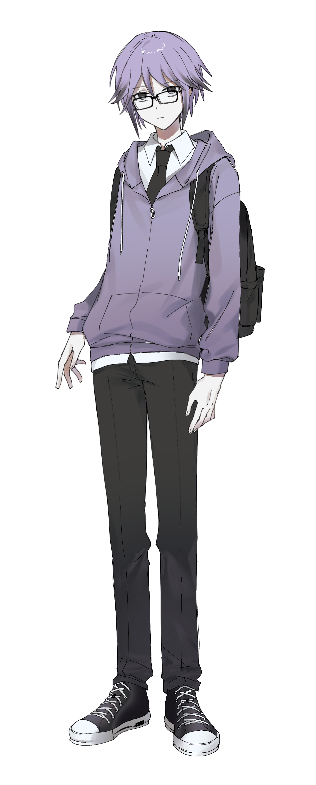
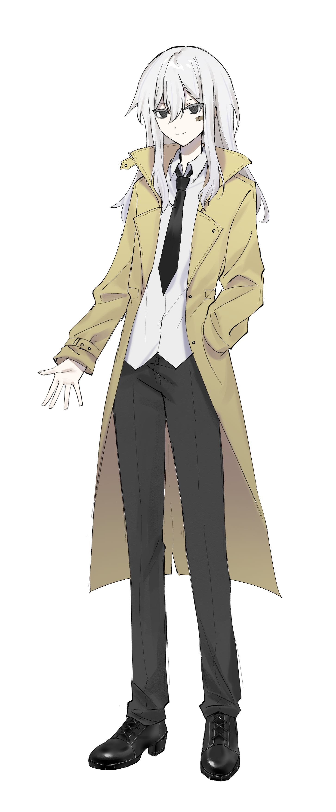

<!-- 引入 Glide.js -->
<link rel="stylesheet" href="https://cdn.jsdelivr.net/npm/@glidejs/glide/dist/css/glide.core.min.css">
<link rel="stylesheet" href="https://cdn.jsdelivr.net/npm/@glidejs/glide/dist/css/glide.theme.min.css">

<!-- 角色快速跳轉 -->

  <button class="char-btn active" data-target="hcz">黑村 紫</button>
  <button class="char-btn" data-target="azmt">東山 旅</button>
  <button class="char-btn" data-target="stn">赤井 刹那</button>
  <!-- 可以繼續添加更多角色按鈕 -->

<!-- 每個角色的輪播圖 -->

  <!-- 黑村紫的輪播 -->
  

    

      <ul class="glide__slides">
        <!-- 第一張圖片 -->
        <li class="glide__slide">
          

            
          

        </li>
        <!-- 第二張圖片 -->
        <li class="glide__slide">
          

            
          

        </li>
        <!-- 第三張圖片 -->
        <li class="glide__slide">
          

            
          

        </li>
      </ul>
      <!-- 添加導航點 -->
      

        <button class="glide__bullet" data-glide-dir="=0"></button>
        <button class="glide__bullet" data-glide-dir="=1"></button>
        <button class="glide__bullet" data-glide-dir="=2"></button>
      

      <!-- 添加左右箭頭 -->
      

        <button class="glide__arrow glide__arrow--left" data-glide-dir="<">←</button>
        <button class="glide__arrow glide__arrow--right" data-glide-dir=">">→</button>
      

    

    <!-- 將說明文字移到輪播外部 -->
    

      <h3>黑村 紫</h3>
      
大學生(計算機科學)/ 構成創始人

      <a href="人物設定(DB)/黑村 紫" class="character-link">查看角色檔案</a>
    

  

  <!-- 東山旅的輪播 -->
  

    

      <ul class="glide__slides">
        <!-- 第一張圖片 -->
        <li class="glide__slide">
          

            
          

        </li>
        <!-- 第二張圖片 -->
        <li class="glide__slide">
          

            
          

        </li>
        <!-- 第三張圖片 -->
        <li class="glide__slide">
          

            
          

        </li>
      </ul>
      <!-- 添加導航點（修正數量） -->
      

        <button class="glide__bullet" data-glide-dir="=0"></button>
        <button class="glide__bullet" data-glide-dir="=1"></button>
        <button class="glide__bullet" data-glide-dir="=2"></button>
      

      <!-- 添加左右箭頭 -->
      

        <button class="glide__arrow glide__arrow--left" data-glide-dir="<">←</button>
        <button class="glide__arrow glide__arrow--right" data-glide-dir=">">→</button>
      

    

    <!-- 將說明文字移到輪播外部 -->
    

      <h3>東山 旅</h3>
      
大學生/人類社會的高效低功耗垃圾回收站

      <a href="人物設定(DB)/東山 旅" class="character-link">查看角色檔案</a>
    

  

  <!-- 赤井刹那的輪播 -->
  

    

      <ul class="glide__slides">
        <!-- 第一張圖片 -->
        <li class="glide__slide">
          

            
          

        </li>
        <!-- 第二張圖片 -->
        <li class="glide__slide">
          

            
          

        </li>
      </ul>
      <!-- 添加導航點 -->
      

        <button class="glide__bullet" data-glide-dir="=0"></button>
        <button class="glide__bullet" data-glide-dir="=1"></button>
      

      <!-- 添加左右箭頭 -->
      

        <button class="glide__arrow glide__arrow--left" data-glide-dir="<">←</button>
        <button class="glide__arrow glide__arrow--right" data-glide-dir=">">→</button>
      

    

    <!-- 將說明文字移到輪播外部 -->
    

      <h3>赤井 刹那</h3>
      
仿生人

      <a href="人物設定(DB)/赤井 刹那" class="character-link">查看角色檔案</a>
    

  

 